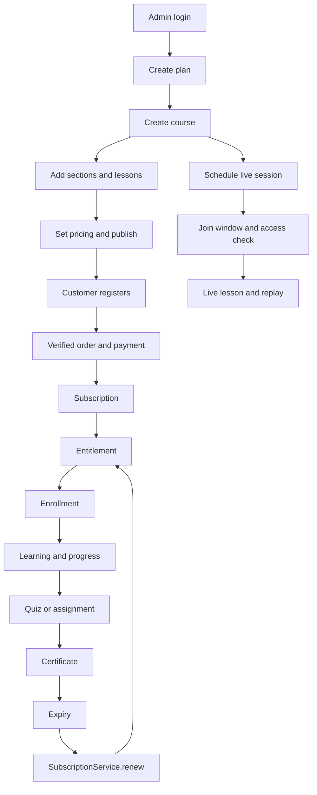

# Admin System Flow

```mermaid
flowchart TD
 A[Admin login] --> B[Create plan]
 B --> C[Create course]
 C --> D[Add sections and lessons]
 D --> E[Set pricing and publish]
 E --> F[Customer registers]
 F --> G[Verified order and payment]
 G --> H[Subscription]
 H --> I[Entitlement]
 I --> J[Enrollment]
 J --> K[Learning and progress]
 K --> L[Quiz or assignment]
 L --> M[Certificate]
 M --> N[Expiry]
 N --> O[SubscriptionService.renew]
 O --> I
 C --> P[Schedule live session]
 P --> Q[Join window and access check]
 Q --> R[Live lesson and replay]
```

Payment currently stops at offline/manual confirmation because no UAE provider is selected. Verified success is the only path to paid fulfillment.
